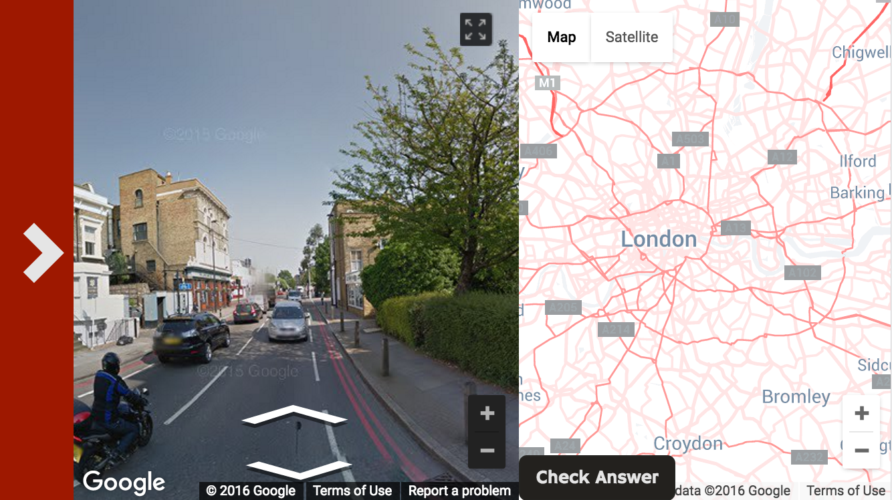
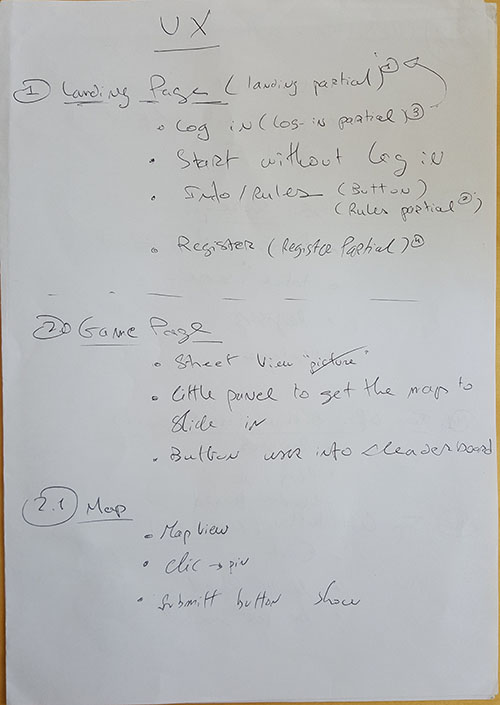
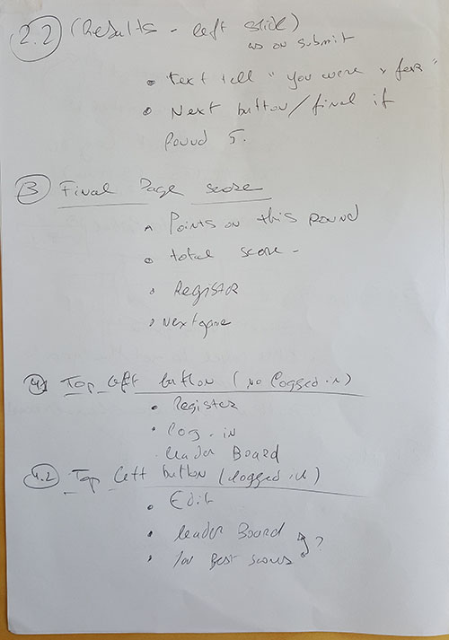
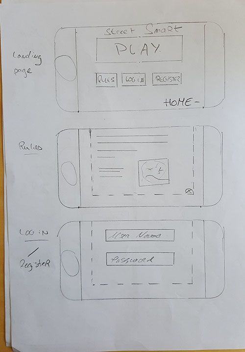
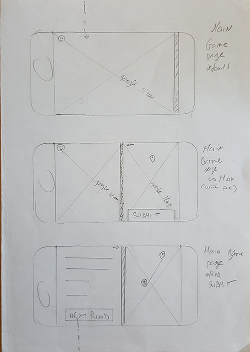
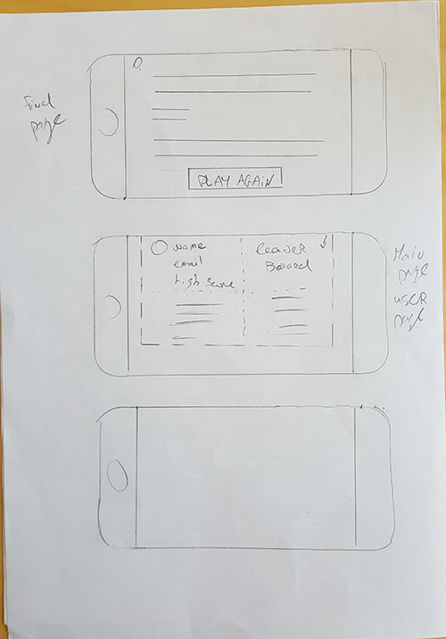

# Street Smart

## Introduction
Street Smart is a web app to test your knowledge of London streets. Players are given a location's street view and asked to identify on a map where the location is.

## Technologies used
- .Node
- Express
- MongoDB
- Javascript
- Google Maps API
- Google Street Views API. 
- Underscore
- Bootstrap

## Goals
- Create a fully functioning web application using the Mongo-Express-Node stack
- Follow mobile first web-design principles
- Use Google Maps API
- Make an interactive game leveraging Google Street Views API
- Design an immersive user experience from start to finish
- Work collaboratively, leveraging Git
- Have fun, and make fun

##Planning
First we decided that we wanted to make an interactive game. After conception of the idea, we started mapping out the user experience we wanted to achieve, and that formed the backbone of our design.

We used Trello to manage our work flow. Tasks were divided from most important to least. 

####Contributors:
Faduma Mohammed, Sebastian Louit, Wei Liang Cheah

